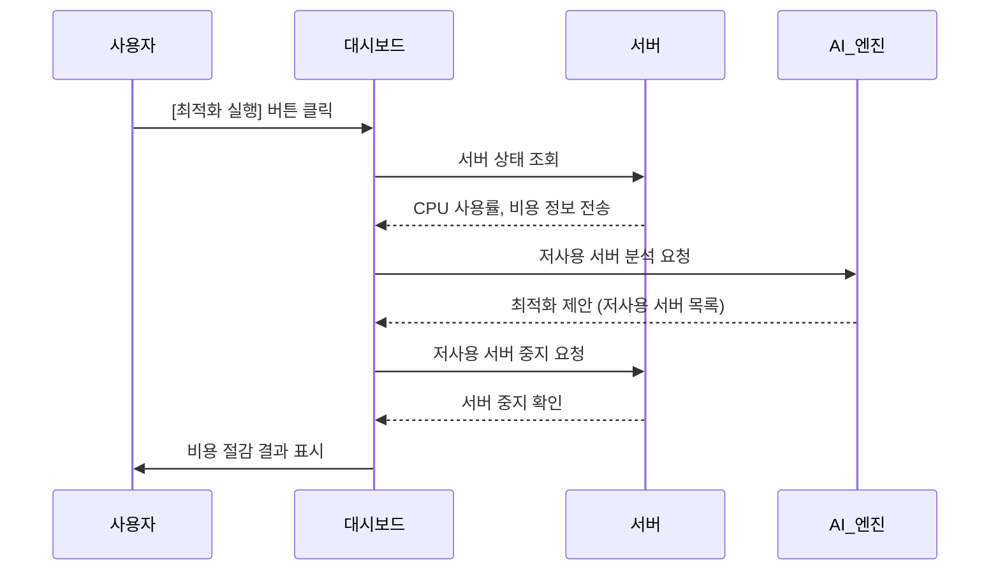
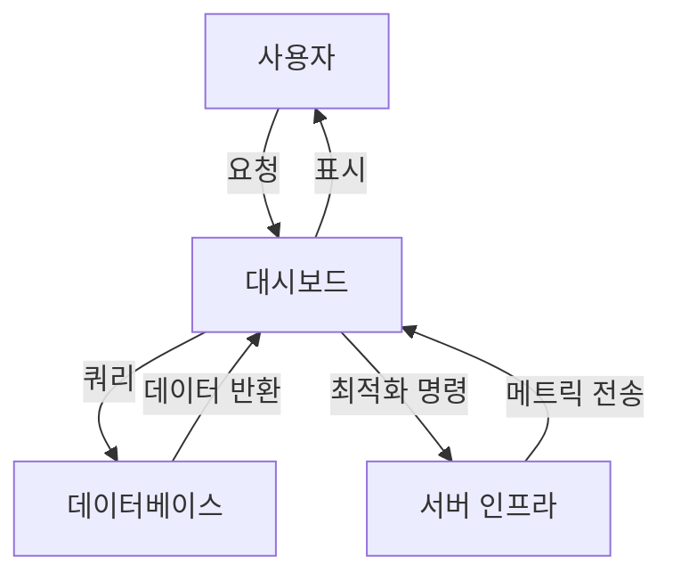

# 클라우드 비용 최적화를 위한 시뮬레이터

클라우드 비용 최적화를 위한 시뮬레이터
서버를 자동으로 감지하고 비용 절감 기회를 시각적으로 보여줍니다.

## 주요 기능

- 실시간 서버 모니터링 (CPU 사용률, 비용)
- AI 기반 비용 최적화 제안
- 월별 비용 절감액 시각화
- 다크 모드 UI

## 시스템 요구사항

- Python 3.7 이상
- Tkinter 라이브러리

## 실행 방법

1. 저장소를 클론합니다.
2. 다음 명령어로 애플리케이션을 실행합니다:
   ```bash
   python main.py
   ```

## 시퀀스 다이어그램



## 시스템 아키텍처

### 1. 전체 아키텍처 다이어그램


### 2. 컴포넌트 설명

1. **사용자 인터페이스 (UI)**
   - Tkinter 기반의 데스크톱 애플리케이션
   - 실시간 서버 모니터링 대시보드
   - 비용 절감 추적 및 시각화

2. **비즈니스 로직**
   - 서버 상태 모니터링 및 관리
   - AI 기반 비용 최적화 알고리즘
   - 사용자 인증 및 권한 관리

3. **데이터 계층**
   - SQLite 데이터베이스
   - 서버 메트릭 및 비용 데이터 저장
   - 사용자 설정 및 기록 보관

### 3. 데이터 흐름



## 사용 방법

1. 왼쪽 패널에서 서버들의 실시간 상태를 확인합니다.
2. 오른쪽 패널의 "AI 비용 최적화 실행" 버튼을 클릭하여 저사용 서버를 자동으로 중지합니다.
3. "서버 재시작" 버튼으로 중지된 서버를 다시 시작할 수 있습니다.
4. 대시보드에서 실시간으로 절감된 비용을 확인합니다.

## 주요 기능

### 서버 모니터링


- 실시간 CPU 사용률 모니터링
- 서버 상태 표시 (실행 중/중지)
- 마지막 업데이트 시간 표시

### 비용 최적화


- AI 기반 자동 최적화
- 월간 예상 절감액 계산
- 최적화 내역 추적

### 서버 관리


- 서버 일괄 시작/중지
- 서버 상태 자동 복구
- 사용자 정의 알림 설정


