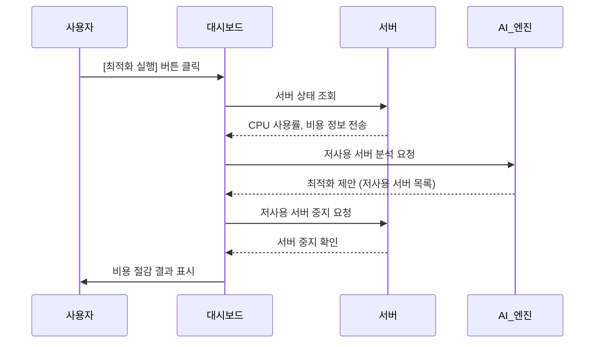

# 클라우드 비용 최적화를 위한 시뮬레이터

클라우드 비용 최적화를 위한 시뮬레이터
서버를 자동으로 감지하고 비용 절감 기회를 시각적으로 보여줍니다.

## 주요 기능

- 실시간 서버 모니터링 (CPU 사용률, 비용)
- AI 기반 비용 최적화 제안
- 월별 비용 절감액 시각화
- 다크 모드 UI

## 시스템 요구사항

- Python 3.7 이상
- Tkinter 라이브러리

## 실행 방법

1. 저장소를 클론합니다.
2. 다음 명령어로 애플리케이션을 실행합니다:
   ```bash
   python main.py
   ```

## 시퀀스 다이어그램




